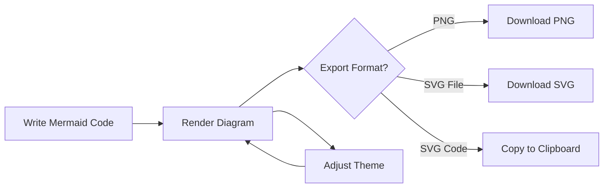
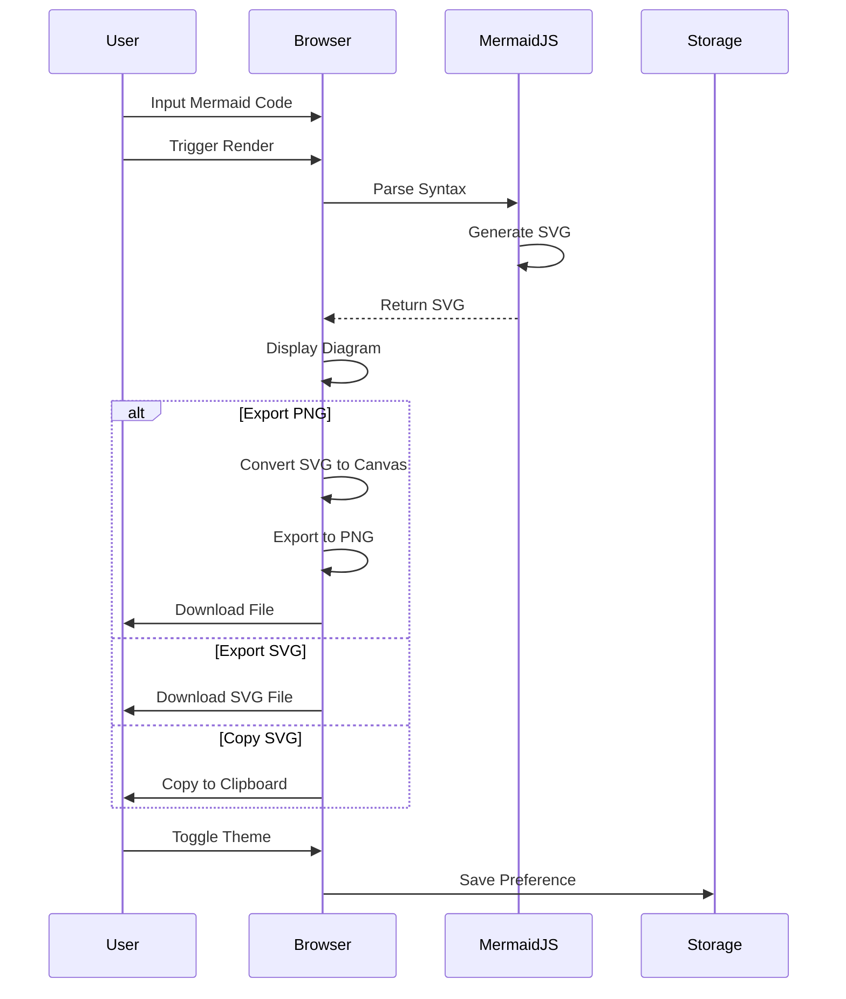

# 🧜 xsukax Mermaid Diagram Converter

A lightweight, privacy-focused client-side application for creating, rendering, and exporting Mermaid diagrams directly in your browser. No server required, no data collection, complete privacy.

## 🔒 Security and Privacy Benefits

This application prioritizes user security and privacy through its architectural design and implementation choices:

- **100% Client-Side Processing**: All diagram rendering and conversions occur entirely within your browser. No data is ever transmitted to external servers, ensuring complete data sovereignty.
- **No Data Collection**: The application does not collect, store, or transmit any user data, diagrams, or personal information.
- **Minimal Permissions**: Only requires basic browser APIs for rendering and file operations. No invasive permissions or tracking mechanisms.
- **Transparent Code**: Fully open-source implementation allows complete code auditing and verification of security claims.
- **Secure Dependencies**: Utilizes the reputable jsDelivr CDN for the Mermaid.js library, ensuring integrity and availability.
- **Local Storage Isolation**: Only stores theme preference locally; no sensitive data persists beyond the current session.
- **No Analytics or Telemetry**: Zero tracking scripts, cookies, or third-party analytics ensure your workflow remains private.

## ✨ Features and Advantages

**Core Functionality**
- Real-time Mermaid diagram rendering with instant visual feedback
- Support for all standard Mermaid diagram types (flowcharts, sequence diagrams, class diagrams, etc.)
- Live preview with automatic SVG generation

**Export Capabilities**
- Export diagrams as high-quality PNG images (2x resolution for crisp output)
- Export diagrams as scalable SVG files
- Copy SVG code directly to clipboard for seamless integration

**User Experience**
- Clean, GitHub-inspired interface design for familiar navigation
- Light and dark theme support with persistent preferences
- Keyboard shortcut support (Ctrl/Cmd+Enter) for efficient workflows
- Responsive design that adapts to mobile and desktop environments
- Monospace font editor for improved code readability

**Technical Advantages**
- Zero-installation: Works immediately in any modern browser
- Offline-capable after initial load
- Minimal resource footprint with optimized performance
- No backend infrastructure required for deployment

## 🚀 Installation Instructions

**Option 1: Direct Usage (Recommended)**

1. Download the `index.html` file from this repository
2. Open the file directly in any modern web browser (Chrome, Firefox, Safari, Edge)
3. Start creating diagrams immediately—no additional setup required

**Option 2: Local Web Server**

For development or testing with strict CORS policies:

```bash
# Using Python 3
python -m http.server 8000

# Using Node.js (http-server)
npx http-server -p 8000

# Using PHP
php -S localhost:8000
```

Then navigate to `http://localhost:8000` in your browser.

**Option 3: GitHub Pages Deployment**

1. Fork this repository
2. Enable GitHub Pages in repository settings
3. Select the main branch as the source
4. Access your deployment at `https://xsukax.github.io/xsukax-Mermaid-Diagram-Converter`

## 📖 Usage Guide

### Basic Workflow

The application follows a straightforward process from code input to diagram export:



### Step-by-Step Instructions

**Creating Your First Diagram**

1. **Enter Mermaid Code**: Type or paste your Mermaid syntax into the text area
   ```
   graph TD
       A[Start] --> B{Decision}
       B -->|Yes| C[Process]
       B -->|No| D[End]
       C --> D
   ```

2. **Render the Diagram**: Click the "Render" button or press `Ctrl+Enter` (or `Cmd+Enter` on Mac)

3. **View the Result**: Your diagram appears in the preview area below

4. **Export Your Work**: Choose your preferred export format:
   - **Export PNG**: Downloads a high-resolution raster image
   - **Export SVG**: Downloads a scalable vector graphics file
   - **Copy SVG**: Copies the SVG code to your clipboard for direct embedding

**Theme Customization**

Toggle between light and dark themes using the moon/sun icon in the header. Your preference persists across sessions.

**Keyboard Shortcuts**

- `Ctrl+Enter` (Windows/Linux) or `Cmd+Enter` (Mac): Render diagram

### Application Architecture

The application's internal flow demonstrates its client-side architecture:



### Common Use Cases

**Software Documentation**
- Create flowcharts for algorithm explanations
- Design system architecture diagrams
- Document API workflows and data flows

**Project Management**
- Visualize project timelines with Gantt charts
- Map user journeys and state transitions
- Illustrate decision trees and processes

**Education and Training**
- Build entity-relationship diagrams for database design
- Develop class diagrams for object-oriented concepts
- Create sequence diagrams for protocol explanations

## 📄 License

This project is licensed under the GNU General Public License v3.0.

## 🤝 Contributing

Contributions, issues, and feature requests are welcome. Feel free to check the [issues page](https://github.com/xsukax/xsukax-Mermaid-Diagram-Converter/issues) if you want to contribute.

## 🔗 Resources

- [Mermaid Documentation](https://mermaid.js.org/)
- [Mermaid Live Editor](https://mermaid.live/)
- [GitHub Repository](https://github.com/xsukax/xsukax-Mermaid-Diagram-Converter)

---

**Built with privacy in mind** 🔐 | **No servers, no tracking, no compromise**
